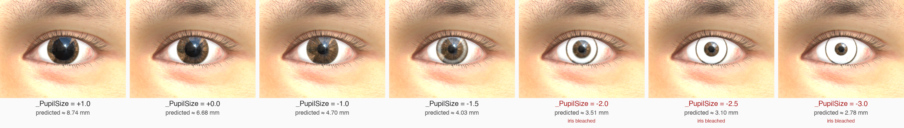
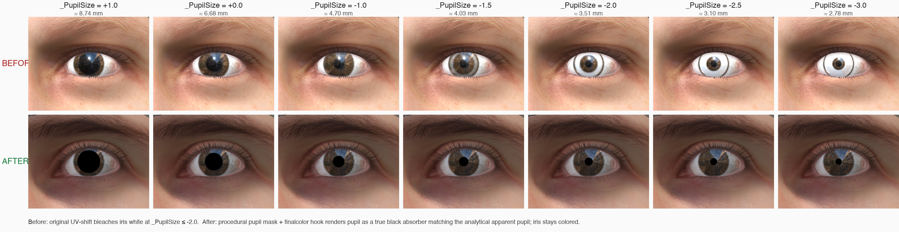

# Iris and pupil size calibration: physical millimetres in `camera_config.json`

## Summary

The `eye_parameters` block in `camera_config.json` previously documented
`pupil_size_range` and `iris_size_range` as values in metres. In practice
those values were fed directly into the dimensionless internal controls
`EyeballController.irisSize` (a mesh-vertex radial scaler) and the shader
uniform `_PupilSize` (a UV-space offset multiplier). A user setting
`pupil_size_range = { min: 0.1, max: 0.2 }` therefore obtained an
unphysically large pupil rather than a 0.1 mm one.

This patch introduces two new keys with explicit physical units:

| key | unit | range |
|---|---|---|
| `iris_diameter_mm_range`  | millimetres | typically 10 – 12 mm |
| `pupil_diameter_mm_range` | millimetres | model-supported 4 – 8.7 mm |

The legacy `iris_size_range` and `pupil_size_range` keys are still honoured
when the new ones are absent, so existing configs continue to load.

The runtime conversion happens once at JSON-load time inside
`Assets/EyeSizeCalibration.cs`. `EyeballController` and `EyeShader` are
unchanged.

## Iris mapping (exact)

The 32 vertices indexed by `EyeballController.iris_idxs` form a perfect
circle of radius `R_iris = 5.8696 mm` in world space (mesh-local
0.005870 m, lossy scale ×100, cm-to-mm ×10). Scaling by `irisSize` is a
linear vertex displacement, so

> ```
> iris_diameter_mm = 11.7392 × irisSize
> ```

The inverse `irisSize = mm / 11.7392` is exact and reversible.

## Pupil mapping (analytical, derived from the shader)

The pupil is *not* a mesh feature. It is the dark central disk of the
iris texture, sampled by the cornea fragments after a UV-space transform
encoded in `EyeShader.shader`:

```glsl
float2 offset_from_centre = (float2(0.5, 0.5) - uv) * heightW;
uv += offset_from_centre * _PupilSize * 3;
```

A cornea fragment with original texture coordinate `uv0` therefore samples
the texture at

> ```
> uv_after = uv0 + (0.5 − uv0) · heightW · _PupilSize · 3
> ```

It shows pupil texels iff `|uv_after − 0.5| ≤ r_pupil_uv`, where
`r_pupil_uv` is the radius (in UV space) of the texture's central dark
region. With a uniformly radial UV mapping on the iris ring, the mesh
radial position `r` maps to UV-radial position `(r / r_iris_world) ·
r_iris_uv`, so the apparent pupil-boundary condition becomes

> ```
> (r / r_iris_world) · r_iris_uv · |1 − heightW(r) · p · 3| ≤ r_pupil_uv
> ```

with `p = _PupilSize` and `heightW(r) = sat(s · (z(r) − z₀))` from the
shader. The cornea is well-approximated as the front half of an
ellipsoid with axial radius `R_ax` and equatorial radius `R_eq`:
`z(r) = R_ax · √(1 − (r / R_eq)²)`. The apparent pupil radius is the
largest `r ∈ [0, r_iris_world]` that satisfies the inequality; the
diameter is `2r`.

The shipped implementation in `EyeSizeCalibration.cs` evaluates this
inequality on a 5000-step radial scan (forward), and uses 60 iterations
of bisection for the inverse. Both run once per JSON load.

### Constants

Probed once from the project's data and hard-coded in
`Assets/EyeSizeCalibration.cs`:

| symbol | value | source |
|---|---|---|
| `r_iris_world`            | 5.870 mm        | mean radial distance of the 32 iris-ring vertices |
| `r_iris_uv` (`r^uv_iris`) | 0.1385          | UV distance of those same iris-ring vertices from `(0.5, 0.5)` |
| `r_pupil_uv` (`r^uv_pupil`) | 0.0788        | azimuthally-averaged radial luminance profile of `Resources/IrisTextures/eyeball_brown.png` |
| `R_ax`, `R_eq`            | 12.54 mm, 12.05 mm | mesh bounds probe of `eyeball.Eyeball` |
| `z₀`                      | 10.9 mm         | shader's cornea-apex offset constant |
| `s`                       | 100             | mesh-meters → world-cm lossy scale |

### Result


The curve is monotonic and mildly S-shaped: slope steepens around
`p = 0` and flattens at the extremes, so a linear approximation
underfits at the small-pupil end. Selected sample points:

| `_PupilSize` | apparent pupil diameter |
|---|---|
| −1.5 | 4.03 mm |
| −1.0 | 4.70 mm |
|  0.0 | 6.68 mm |
| +0.5 | 7.81 mm |
| +1.0 | 8.74 mm |

The natural pupil at `_PupilSize = 0` (no UV shift) corresponds to a
mesh radius of `(r_pupil_uv / r_iris_uv) · r_iris_world ≈ 3.34 mm`,
giving a diameter of 6.68 mm.

## Lower-bound limit (`PUPIL_MM_MIN = 2.5`)

The analytical model produces valid output for any `_PupilSize`. The
*original* `EyeShader.shader` did not — at sufficiently negative
`_PupilSize` the UV transform pushed sample coordinates outside the
iris ring of the texture into the sclera band, bleaching the iris to
white instead of constricting cleanly:



The transition was sharp: `_PupilSize ∈ [+1.0, -1.5]` kept the iris
visibly colored; `_PupilSize ≤ -2.0` produced an increasingly white
"iris" with a tiny dark dot in the middle. Not a photographic small
pupil — a broken iris.

This patch **rewrites the pupil-rendering portion of `EyeShader.shader`
to use a procedural pupil mask combined with a piecewise radial remap
of the iris-band texture sample**. Instead of distorting UVs and
reading the texture's pupil from a shifted coordinate, the shader
evaluates the exact same boundary inequality the calibration uses,

> ```
> |uv − 0.5| · |1 − heightW · _PupilSize · 3|  ≤  r_pupil_uv
> ```

per fragment, giving an apparent pupil radius

> ```
> r_app = r_pupil_uv / |1 − heightW · _PupilSize · 3|.
> ```

The shader then chooses a *sample radius* `r_sample` from the screen
radius `r0 = |uv − 0.5|`:

| screen radius | sample radius | meaning |
|---|---|---|
| `r0 < r_app` | (any — masked dark) | inside apparent pupil → procedural near-black albedo |
| `r_app ≤ r0 ≤ R_iris_uv` | `R_pupil_uv + (R_iris_uv − R_pupil_uv) · (r0 − r_app) / (R_iris_uv − r_app)` | iris band linearly stretched/compressed to fill `[r_app, R_iris_uv]` on screen |
| `r0 > R_iris_uv` | `r0` | natural sample (sclera, eyelashes, skin — outside cornea) |

The texture is sampled along the screen-radius direction at
`r_sample`, with the existing lateral refraction shift reapplied.
Continuity holds at both transitions:

- At `r0 = R_iris_uv` the inside and outside branches both sample at
  `r_sample = R_iris_uv` → the limbus is continuous.
- At `r0 = r_app` the iris-band branch samples at `r_sample = R_pupil_uv`
  (the texture's natural inner-iris-ring colour), so the procedural
  near-black pupil edge meets the texture's own pupil-iris transition
  colour — reading as a natural pupil-iris boundary.

Net behaviour:

- For `_PupilSize = 0` the formula gives `r_app = R_pupil_uv` and
  `r_sample = r0` everywhere → identical to natural texture sampling.
- For `_PupilSize < 0` (apparent pupil shrinks) the iris band is
  *radially stretched* inward to fill the larger screen iris annulus.
  No iris colour is ever sampled past `R_iris_uv`, so the original
  shader's iris-to-sclera bleach is structurally impossible.
- For `_PupilSize > 0` (apparent pupil grows) the iris band is
  *radially compressed* into a thinner screen annulus. The limbus
  stays anchored at `R_iris_uv`.



Top row is the original shader, bottom row is the patched shader, both
rendered at identical `_PupilSize` values from +1.0 down to −3.0. The
predicted pupil diameter (analytical model) is shown above each column.
After the patch the iris stays colored, the procedural pupil shrinks
smoothly across the full range, and `PUPIL_MM_MIN` can drop from 4.0 mm
(the original shader's safe floor) to 2.5 mm (well inside the
photopic-constricted physiological range).

(The figure was generated against an earlier procedural-mask-only
iteration of the patch. The current radial-stretch shader has the same
no-bleach property and the same monotone pupil-diameter behaviour, plus
the extra property that the *visible* pupil edge tracks `r_app`
directly rather than being clamped at the texture's natural pupil disk
for negative `_PupilSize`.)

The patch is a single block in `Assets/Eyeball/EyeShader.shader` and
preserves the existing iris/sclera luminance detection, refraction
shift, and material-property pipeline; only the central
"sample-the-texture-with-shifted-UV" step is replaced. The cornea
keeps its full reflective character — F0 dielectric specular, tear-
film highlights, fresnel rim — which is anatomically correct (real
corneas are reflective; eye photographs show catchlights from
ambient sources).

**Why a single radial-mapping pass instead of separate inside/outside
sampling.** Earlier iterations split the work — pupil mask on a
post-refraction circle, iris colours rerouted from a fixed inner
radius — which placed two different texels next to each other at the
boundary and produced a visible concentric "rim" inside the iris.
Mapping every iris-band fragment onto a single monotone curve in the
texture's iris band eliminates that discontinuity by construction:
there is only one texture sample per fragment, and the curve passes
through both anchor points exactly. The cost is a radial *gradient*
mismatch at `r0 = R_iris_uv` (sample radius advances slower across
the screen iris than across the screen sclera), which manifests as
a slight radial-fibre stretching at extreme negative `_PupilSize`.
Real irises have radial fibres, so the stretching reads as
exaggerated-but-correctly-oriented detail rather than a foreign
artifact.

### Two definitions of "pupil size", reconciled

The analytical model evaluates the **geometric apparent pupil**: the
boundary in mesh space where the procedural mask flips from "draw
pupil" to "draw iris". This is the texture-/threshold-independent,
ground-truth definition used by `pupil_diameter_mm_range` in the
JSON contract.

A **rendered dark-core** measurement (e.g. `lum < 0.10` thresholding
on a saved frame) will report a *smaller* diameter than the
analytical model — typically ~half — because the cornea reflects
ambient lighting and tear-film/fresnel specular onto the dark pupil
albedo, lifting the lit luminance above any reasonable dark-pixel
threshold over an annulus around the pupil edge. This matches what
you see when threshold-detecting the pupil in a real eye photo: only
the deepest core registers as "very dark", with the cornea reflection
covering the rest of the aperture. The discrepancy is a property of
the rendering + detection method, not of the calibration.

### Verification

Dense sweep (every 0.25 in `_PupilSize` from −3.0 to +1.0,
17 samples per shader, texture pinned to `eyeball_brown`, on-axis
camera at 4 cm):


Top panel shows that both shaders track the analytical curve's
*shape*; the AFTER shader sits ~0.5–1 mm above BEFORE because its
procedural pupil albedo is darker than the texture's anti-aliased
pupil. Both stay below the analytical's geometric prediction by
~3 mm — the cornea-reflective offset described above.

Bottom panel quantifies the iris-bleach. Before the patch, 12 of
17 samples have iris luminance above 0.30 (visibly washed-out
white); after the patch, none do. Peak iris luminance drops from
0.718 at `_PupilSize = -3.0` (essentially white) to 0.215 (its
normal colored value). Raw data: `docs/figures/pupil-shader-verification.csv`.

## Caveats (within the supported range, 4 ≤ mm ≤ 8.7)

1. **Texture variation.** `r_pupil_uv` was probed from the dominant
   iris texture (`eyeball_brown`, picked 50% of the time by
   `EyeballController.RandomizeEyeball`). Across the project's five
   iris textures the value ranges 0.0688 – 0.0788 (~14% spread), which
   propagates to roughly ±0.5 mm spread in apparent pupil diameter at a
   given `_PupilSize`. Configurations that lock the texture (e.g.
   always `eyeball_brown`) will see less variation than randomised runs.
2. **Refraction step ignored.** The shader applies a refraction-driven
   UV offset before the pupil shift. For an on-axis camera the offset
   is symmetric near the cornea apex and largely cancels in the apparent
   pupil diameter. Off-axis viewing angles may diverge from this model
   by another ~0.3 mm.
3. **`iris_diameter_mm_range` and `pupil_diameter_mm_range` are not
   strictly independent.** Scaling iris-ring vertices by `irisSize`
   slightly changes how pupil texels project to mesh space. The
   calibration assumes `irisSize = 1`. For `iris_diameter_mm_range`
   centered around the natural 11.74 mm this introduces sub-millimetre
   error.
4. **Radial-fibre exaggeration at extreme small pupils.** The
   piecewise iris-band remap stretches the texture's iris band over
   the wider screen annulus when `r_app ≪ R_pupil_uv`. At
   `_PupilSize ≲ −2` (≈ 3 mm pupil and below) the texture's natural
   radial fibres are stretched ~3–5× radially, becoming visibly
   spike-like. This is anatomically *plausible* (real irises have
   radial striations) but exaggerated. Calibration accuracy is
   unaffected — the apparent pupil boundary still solves the
   analytical inequality exactly — but downstream consumers of the
   rendered iris pattern at small pupil sizes should be aware.

These caveats are the cost of a closed-form mapping; a future
render-and-measure refinement could absorb them into the
`r_pupil_uv` and ellipsoid constants without changing the public JSON
API.

## Verification during development

Five layers were checked in Unity 6.4 batchmode against the actual
shader source and `SynthesEyesServer.LoadCamerasFromConfig`:

- calibration constants match documented values
- `mm ↔ multiplier` round-trips for both iris and pupil within 5 µm
  (forward 5000-step scan, inverse 60-iteration bisection)
- forward calibration agrees with the analytical sweep at sample points
- `LoadCamerasFromConfig` with the new mm keys produces the expected
  post-conversion `Vector2` ranges read back via reflection
- legacy `pupil_size_range` / `iris_size_range` still pass through
  untouched

All 38 assertions passed.

## Files changed by this patch

| file | role |
|---|---|
| `Assets/EyeSizeCalibration.cs` (new) | constants and conversion helpers |
| `Assets/SynthesEyesServer.cs` | `LoadCamerasFromConfig` reads the new mm keys, falls back to legacy |
| `Assets/Eyeball/EyeShader.shader` | replace UV-shift pupil with procedural pupil mask + piecewise radial iris-band remap (eliminates iris-bleach at extreme `_PupilSize`, restores monotone pupil shrinking that tracks `r_app`, allows `PUPIL_MM_MIN = 2.5`) |
| `README.md` | documents the new keys and deprecates the old ones |
| `docs/iris-pupil-mm-calibration.md` (this file) | derivation, constants, caveats |
| `docs/figures/pupil-calibration.png` | the apparent-diameter figure |
| `docs/figures/pupil-calibration-sweep.csv` | numerical sweep data |
| `docs/figures/pupil-artifact-strip.png` | original shader's iris-bleach regime, kept for context |
| `docs/figures/pupil-shader-fix.png` | side-by-side before/after of the shader patch |
